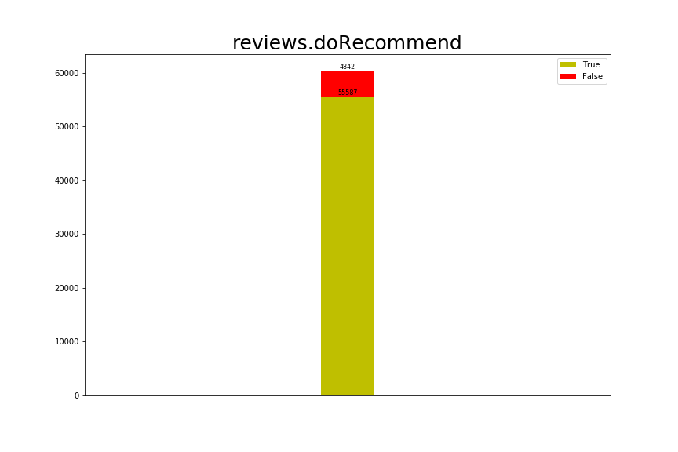
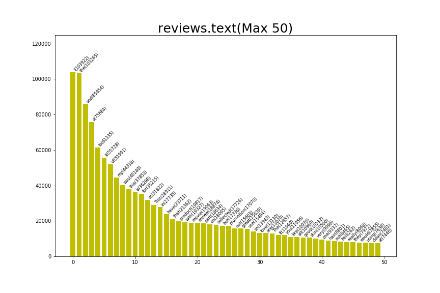

## 一、Grammar and Online Product Reviews数据集分析探索

根据之前对所要研究的问题的概括性讨论，对于数据集中的一些次要特征，诸如商品条码、用户个人信息、日期信息等数据，我们暂且排除于讨论范围之外。通过预先对有用特征进行人为筛选，我们选择了以下10个特征项作为此次研究项目中建模的依据：

| 特征标签 | 含义 |
| -------  | ---- |
| brand | 品牌名称 |
| categories | 产品类别 |
| manufacturer | 生产商 |
| name | 产品名称 |
| reviews.didPurchase | 是否购买 |
| reviews.doRecommend | 是否推荐 |
| reviews.numHelpful | 认为评论有帮助人数 |
| reviews.rating | 评论评分 |
| reviews.text | 评论正文 |
| reviews.title | 评论标题 |

在提取数据的统计性描述过程中，首先需要明确每一特征列中数据的类型。在这个数据集之中，有“brand”、“categories”、“manufacturer”、“name”、“reviews.text”、“reviews.title”6个特征均为文本数据（字符串格式）。关于文本的统计特征，最直观的便是单词出现的频数和频率。通过展示不同品牌名称、产品类别、生产商和产品名称所出现的频数，我们可以掌握数据集的一些基本特性，如一共统计了多少种不同品牌，这些品牌都归属于哪些类别，它们的生产商都有哪些。

经过初步的统计，该数据集一共包含600种商品、共计71044个商品样本。它们分属581个商品类别，其中包括392个不同品牌，由463家不同的厂商所生产。更具体的信息如下所示：

#### 1.1 品牌名称（brand）

出现次数最多的品牌名称为Clorox，共出现10700次。 
出现次数第2多的品牌名称为Universal Home Video，共出现6178次。 
出现次数第3多的品牌名称为Tide，共出现5384次。 
出现次数第4多的品牌名称为FOX，共出现4498次。 
出现次数第5多的品牌名称为Disney，共出现3692次。 

图表中展示了不同品牌的商品所出现的频数分布，可以看出其中有出现多达10000余次的，而更多品牌出现次数则不足2000次。据统计，频数的均值为181.2，中位数为9.0。

#### 1.2 产品类别（categories）

出现次数最多的产品类别为 
Household Essentials,Cleaning Supplies,Kitchen Cleaners,Cleaning Wipes,All-Purpose Cleaners,Health & Household,Household Supplies,Household Cleaning,
Ways To Shop,Classroom Essentials,Featured Brands,Home And Storage & Org,Clorox,Glass Cleaners,Surface Care & Protection,Business & Industrial,
Cleaning & Janitorial Supplies,Cleaners & Disinfectants,Cleaning Wipes & Pads,Cleaning Solutions,Housewares,Target Restock,Food & Grocery,Paper Goods,Wipes,All Purpose Cleaners， 
共出现8606次。 
出现次数第2多的产品类别为 
Featured Brands,Character Shop,The Secret Life Of Pets,Movies, Music & Books,Movies,Kids' & Family,Movies & TV,4K Ultra HD Movies,Movies & Music,Movies & TV Shows,Blu-ray， 
共出现5510次。 
出现次数第3多的产品类别为 
Movies, Music & Books,Movies,Action & Adventure,Movies & TV,4K Ultra HD Movies,Ways To Shop Entertainment,Recent Release & 4k Movies Sale,Movies & Music,
Movies & TV Shows,4k Resolution， 
共出现3609次。 
出现次数第4多的产品类别为 
Household Essentials,Ways To Shop,Household Essentials Subscriptions,Laundry Care,Featured Brands,Industrial & Scientific,Janitorial & Sanitation Supplies,Laundry Supplies,Laundry Detergent,Liquid Detergent,Laundry,Laundry Detergents,Target Restock,Health & Household,Household Supplies,Toys,Laundry Room， 
共出现3498次。 
出现次数第5多的产品类别为 
Movies, Music & Books,Movies,Action & Adventure,Movies & Music,Movies & TV Shows,Frys， 
共出现3330次。 

图表中展示了不同产品类别所出现的频数分布，均值为122.2，中位数为8.0。

#### 1.3 生产商（manufacturer）

出现次数最多的生产商为Clorox，共出现8607次。 
出现次数第2多的生产商为Universal，共出现6178次。 
出现次数第3多的生产商为Twentieth Century Fox，共出现4366次。 
出现次数第4多的生产商为Procter & Gamble，共出现3503次。 
出现次数第5多的生产商为Test，共出现3330次。 

图表中展示了不同生产商所出现的频数分布，均值为153.1，中位数为9.0。

#### 1.4 产品名称（name）

出现次数最多的产品名称为Clorox Disinfecting Wipes Value Pack Scented 150 Ct Total，共出现8606次。 
出现次数第2多的产品名称为The Secret Life Of Pets (4k/uhd + Blu-Ray + Digital)，共出现5510次。 
出现次数第3多的产品名称为Independence Day Resurgence (4k/uhd + Blu-Ray + Digital)，共出现3609次。 
出现次数第4多的产品名称为Tide Original Liquid Laundry Detergent - 100 Oz，共出现3498次。 
出现次数第5多的产品名称为Godzilla 3d Includes Digital Copy Ultraviolet 3d/2d Blu-Ray/dvd，共出现3330次。 

图表中展示了不同产品名称所出现的频数分布，均值为118.4，中位数为8.0。

从这四项有关产品本身的数据统计，反映出数据集对于网评所对应商品的采样存在一定程度上的不均匀性，一部分商品被采集的次数太多，而过半商品则只有不到10次采样（由中位数可见）。这也许会反映出不同商品在电商网站上的受欢迎程度差异，因为较火热的商品可能更倾向于获得更多的评论。或许在数据分析的过程中，需要将“产品的冷热门程度”作为一个考虑因素，适当为这些特征添加一些权重。同理，在品牌以及生产商方面，也要相应考虑品牌和厂商知名度对用户做出评价和购买产品的影响。

#### 1.5 是否购买产品（reviews.didPurchase）

Amazon上的商品无需购买即可评论，这也使得“是否购买”成为了一个影响用户评论的潜在特征。不过具统计，本数据集中这一特征的数据缺失率极高，达到了54.73%。这可能是由于用户隐藏自己购买信息所致。在现有数据里，有3682个数据值为True，占比为5.182%；有28476个数据数值为False，占比为40.08%。这反映出，在不缺失的数据当中，未购买商品的用户数量比例要远高于购买商品用户数量的比例。这是否说明存在用户刻意乱评价的可能性，我们尚需对数据作进一步的研究才可能得出更深入的推论。同时，对于这部分缺失数据的填补将会是一项颇有挑战性的任务。究竟那些缺失的数据当中，用户购买产品的比例是和未缺失部分的分布相近（即未购买人数比例远大于购买人数），还是这些隐藏数据的用户其实多为买家？这也是一个颇具讨论价值的问题。

是否购买的人数分布如图所示

#### 1.6 是否推荐（reviews.doRecommend）

与上述特征不尽相同的是，该特征的数据缺失率仅为14.94%，甚至低于未购买产品的用户比例。这很清晰地反映了，有相当一部分用户都在没有购买商品的情况下对商品做出了“是否推荐”的建议。虽然这个现象乍看上去可能会令人感到惊讶，但是我们或许可以通过对数据的表面观察做出一些推论和假设。在本数据集中，有55587个数据数值为True，占比78.24%；有4842个数据数值为False，占比6.815%。大多数用户都对产品给出了“推荐”的积极建议。这样的结果不可不谓“耐人寻味”，联想起我们在之前的工作中所提及有关“水军”的问题，这些并未购买产品却给出好评的用户，是否有效反映消费者群体对产品的真实偏好？不过也存在一些用户通过其他渠道购买产品，之后再通过电商平台向商家和其他用户反馈产品功效的可能性。如何去深入探究这些可能性也是有待我们解决的一方面问题。

是否推荐的人数分布如图所示

#### 1.7 认为评论有帮助人数（reviews.numHelpful)

缺失数据的样本数为38536，占比54.24%。其中0值出现频率为29596。
均值为0.410，中位数为0.0，方差为12.77。

由此可见该数据无论是缺失率还是零值率都非常高，因为该特征可以衡量评论对其他用户的有价值程度。如果用户评论中充斥着大量无营养评论，其他用户也不会去为这些“垃圾评论”点赞，则自然也不会有过多的非零值出现。在2912个非0数据当中，极大值为183.0，均值为4.581，中位数为2.0。

似乎可见，非常受其他用户推崇的评论真可谓屈指可数。虽说在分析评论的过程当中，这项指标可能对样本权重产生影响，但或许这种影响会十分有限。若不能将这种有限的影响同数据噪声所区分，则存在将该特征排除于考虑范围之外的可能性。

#### 1.8 评论评分（reviews.rating）

与上述特征作为本数据集中仅有的两项数值特征，评论评分对于我们所研究课题的重要性却是不言而喻。这项指标直接定量决定了用户评论对产品偏好的评价，最差为1星，最好为5星。该项也是唯二没有数据缺失的特征之一（另外一项是产品名称）。关于我们如何利用机器学习判断用户评论是好评还是差评这个问题，该特征自然会成为分类的依据和标签。

图表展示了用户对所有样本的评级分布。评级为1的数量是3701，占比5.209%；评级为2的数量是1833，占比2.580%；评级为3的数量是4369，占比6.149%；评级为4的数量是14598，占比20.54%；评级为5的数量是46543，占比65.51%。评分均值为4.385，中位数为5.0，方差为1.139。可以看出，大部分用户都对商品给出了五星好评。那么我们已经知道了数据集里包含600种不同的产品。对于每一个产品来说，用户对其的评分情况如何？这是我们接下来仍需完成的工作之一。

#### 1.9 评论正文（reviews.text）

这也是我们研究课题的核心内容，即通过分析用户评论的内容来对其他特征作出预测，以及探究评论文字语法与其他特征的相关性。首先需要做的是对文字进行拆分编码，并统计每一个单词在全部文本集合当中出现的频率。统计过程中剔除了全部标点符号，且区分大小写（例如“Great”与“great”被视为两个不同的单词）。之后关于如何判断只存在大小写差异的单词是否同义，还需做进一步处理（如“Great”与“great”或许并无太大意义差异，但“China”与“china”的意思则有很大不同）。

据统计，数据集中共有2796999个单词，其中共有47860个不同的单词。
出现频率最高的单词为I，共出现103922次。 
出现频率第2高的单词为the，共出现103265次。 
出现频率第3高的单词为and，共出现85954次。 
出现频率第4高的单词为a，共出现75684次。 
出现频率第5高的单词为to，共出现61335次。 
频率的均值为58.44，中位数为1.0。

图表展示了出现频率最高的前50个单词。经粗略浏览可以看出，其中包含大量类似“I”、“the”、“and”、“to”等代词和连词，这些高频词汇中蕴含的信息量实际可能极为有限。我们需要考虑如何能够正确过滤掉这些意义不大的常见词汇，筛选出包含所需信息的单词，这是一个有待解决的问题。与此同时，还需确定合适的为单词划分权重的算法。

#### 1.10 评论标题（reviews.title）

对标题和正文文字的数据提取可谓异曲同工。有待解决的问题与正文部分也颇为接近，但标题中代词出现的频率可能会大幅度降低，这使得过滤无意义词汇的过程不能一概而论。

据统计，数据集中共有231359个单词，其中共有14758个不同的单词。
出现频率最高的单词为Great，共出现10968次。 
出现频率第2高的单词为movie，共出现8380次。 
出现频率第3高的单词为the，共出现4015次。 
出现频率第4高的单词为Good，共出现3650次。 
出现频率第5高的单词为for，共出现3622次。 
频率的均值为15.67，中位数为1.0。

图表展示了出现频率最高的前50个单词。

## 二、问题的进一步提出以及对解决方案的初步探索

在之前的工作里，我们考虑了如下几个值得研究的问题：

这是数据上传者所提出的问题：

* Do reviewers use punctuation correctly? 
 评论者是否正确使用标点符号？
* Does the number of spelling errors differ by rating? 
 拼写错误的数量是否与评价等级相关？
* What is the distribution of star ratings across products? 
 产品之间星级评价的分布是什么样的？
* How does review length differ by rating? 
 评论长度和评价等级是否相关？
* How long is the typical review? 
 一般的评论长度为多少？
* What is the frequency of words with spelling errors by rating? 
 依评价等级划分，拼写错误频率如何？
* What is the number of reviews that don’t end sentences with punctuation? 
 有多少评论在句尾不加标点符号？
* What is the proportion of reviews with spelling errors? 
 有拼写错误的评论占比多少？

这是我们补充的问题：

1. 如何根据评论内容填补“是否购买”和“是否推荐”两栏中的缺失数据。
2. 根据不同评价等级在评论当中所展现的不同特征单词，比如出现“good”很可能代表用户对产品评价较高，而出现“waste of money”则很可能反应用户对产品的不满，从而对上述缺失数据的填补起到帮助作用，或在新的评论数据引入的时候根据特定单词来推测产品本身的质量。
3. 不同产品类别对应的目标买家人群也会有所差别，所以不但可以分析评论长度和语法错误与产品质量的相关性，更可以拓展讨论其与产品类别的相关性。
4. 通过分析同一厂商的不同产品和同一类别不同产品所获好评率的差异，预测之前用户的评论对后续用户购买产品以及评论是否会产生连带影响，比如一个产品前五个人都说不好，很可能第六个人的评论也是差评，即“惯性效应”。
5. 在好评率较高的产品中出现差评和在差评率较高的产品中出现好评时，是否可能通过检查语法的准确率和用词的一致性来鉴别存在“水军”评论的可能性。

可以把这些问题大致分成两类：判别用户评论的语法正确性、根据用户评论对产品特征进行预测以及相反。其中对于第一个问题，初步考虑的方法包括但不限于：人为界定“语法错误的”标准，并根据标准对文本数据样本进行二分类（正确、错误），然后通过监督学习算法解决分类问题；不预先界定何为“正确的语法”，而是对文本数据进行无监督学习，通过聚类划分不同的文本数据，再由对聚类结果的观察来人为添加“正确”或“错误”的分类标签。对于第二个问题，特别是根据文本信息对产品评级，虽然表面上是一个五分类问题，但是可以将评分连续化，从而转化为回归问题加以解决。如何理清产品名称、品牌、生产商、类别等标签之间的对应关系也是一个需要关注的难点。

最后在观察数据“categories”特征时，我们注意到一个问题，那就是categories每一个单位的数据实际上并非对应产品的唯一类别，而是多个类别标签的叠加，用逗号加以分隔。这也就意味着，虽然这些个类别标签的总体也可以作为对产品类别的一种划分，但是将这些标签拆分后再对每个产品进行分类，也同样成立。例如数据中出现次数第3多的类别和出现次数第5多的类别都包含了“Movies”一项，这意味着属于这两个类别下的产品也同属于“Movies”这一大类。如何实现类别划分的多样性，也是我们接下来需要实现的一个方面。
